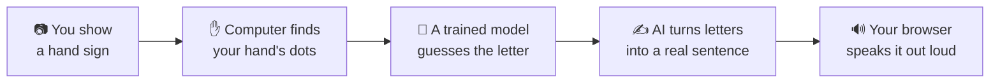

# 🤟 SignBridge

**A magic mirror for hands.** 🪞 You sign a letter, the camera watches, and the computer says it out loud. Built for STEMist Hacks IV.

### 🌐 Try it right now — no install needed!

## 👉 [signbridge-asl.streamlit.app](https://signbridge-asl.streamlit.app/) 👈

---

## 🗺️ What Happens When You Use It



That's the whole trick! Camera → Dots → Letters → Sentence → Voice. 🎉

---

## 🧭 Guided Tour — Pick Where You Want to Go

| I want to... | Go here |
|---|---|
| 🧠 See how the guessing-robot model was built & tested | [`model/README.md`](model/README.md) |
| 📱 Check out the phone app | [`mobile/README.md`](mobile/README.md) |
| 🔌 See the real backend (FastAPI + Render Workflow) | [`backend/README.md`](backend/README.md) |
| ☁️ Put this on Hugging Face too | [`deployment/huggingface_space/README.md`](deployment/huggingface_space/README.md) |
| ✅ See our whole weekend build plan with checklists | open `../index.html` in a browser |

---

## 📊 Where Things Stand Today

| Piece | Status | Notes |
|---|---|---|
| 🧠 Model | ✅ Working | Full A–Z alphabet, ~98% accuracy, trained on 60,000+ examples |
| 🖥️ Web app (Streamlit) | ✅ **Live on the internet** | [signbridge-asl.streamlit.app](https://signbridge-asl.streamlit.app/) — free, works on any device |
| 🖥️ Web app (Gradio) | ✅ Works locally | `python app/main.py` on your own computer |
| ✍️ Sentence builder | ✅ Working | Uses Gemini if you add a key, otherwise free `llm7.io` automatically |
| 🔌 Backend API | ✅ **Live on Render** | `/sentence` is fully real (runs on a genuine Render Workflow); `/predict` is built and deployed but needs a bigger (paid) instance to run reliably — see [`backend/README.md`](backend/README.md) |
| 📱 Mobile app | 🟡 Built, camera recognition mocked | Sentence-building is genuinely live; camera recognition uses mock data until `/predict` has a bigger instance behind it |
| ☁️ Hugging Face Space | 🟡 Ready, not deployed | Needs a paid HF "Pro" plan to host a Python app for free-tier CPU — see its README |

---

## 🧩 What's Inside This Folder

```
SignBridge/
├── 🧠 model/            → the guessing-robot brain (see model/README.md!)
├── 🖥️ app/              → the web apps (Streamlit + Gradio) that use the brain
├── 📱 mobile/           → the phone app
├── 🔌 backend/          → the real API on Render (FastAPI + a Render Workflow)
├── ☁️ deployment/       → files for hosting on Hugging Face
├── 📂 data/             → hand-photo data turned into numbers
├── 📋 requirements.txt  → the list of tools Python needs to install
└── 🔑 .env.example      → template for your secret keys (API keys)
```

---

## 🚀 Run It On Your Own Computer

```bash
cd SignBridge
python -m venv .venv
.venv\Scripts\activate          # Windows
pip install -r requirements.txt
```

**1️⃣ Get some hand data:** put labeled photos in `data/raw/<LETTER>/*.jpg`, then:
```bash
python extract_landmarks.py
```

**2️⃣ Train the guessing robot:**
```bash
python model/train.py
```

**3️⃣ (Optional) Add a free Gemini key** for extra-smooth sentences — copy `.env.example` to `.env` and paste your key from [aistudio.google.com](https://aistudio.google.com/apikey). No key? No problem — a free backup (`llm7.io`) kicks in automatically. 🆓

**4️⃣ Run the app:**
```bash
streamlit run app/streamlit_app.py   # 🌟 same as the live website
# or
python app/main.py                    # Gradio version
```

---

## ⚠️ One Nerdy Warning

The version of MediaPipe (our hand-dot-finder tool) used here is newer than most tutorials online. Old tutorials use `mediapipe.solutions.hands` — **that doesn't exist anymore** and will crash! We already handled this for you inside `model/hand_landmarker.py`. Just don't bring that old code back. 🙅‍♂️

---

Built with 🤟 for STEMist Hacks IV.
