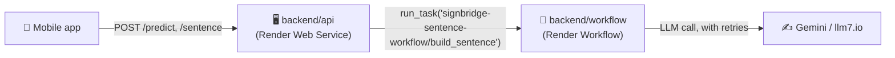

# 🔌 SignBridge Backend (Render)

This is the real API the mobile app talks to — two small services, both deployed on **Render**:

- 🖥️ API: https://signbridge-api-bruo.onrender.com
- 🧠 Workflow: `signbridge-sentence-workflow` (dashboard-only, no public URL — triggered via the Render API)



- **`api/`** — a FastAPI web service. Handles `POST /predict` (camera frame →
  recognized letter) and `POST /sentence`.
- **`workflow/`** — a **Render Workflow** service. `POST /sentence` on the API
  hands the actual sentence-building off to this as a durable task — an LLM
  call is exactly the kind of slow/flaky external call Workflows' built-in
  retries are for. If the workflow isn't configured or fails, the API falls
  back to running the same logic in-process, so `/sentence` never just breaks.

## ⚠️ Known limitation: `/predict` doesn't actually work in production

`/predict` needs mediapipe + OpenCV + scikit-learn loaded in the same process,
which together need more RAM than Render's free tier gives a web service
(512MB — even the cheapest paid "Starter" tier is still capped at 512MB;
only "Standard" at $25/month gives enough). Confirmed by repeated live
testing: the request reliably OOM-crashes the whole service every time.

To keep `/health` and `/sentence` working despite this, `app.py` **lazy-loads**
mediapipe/OpenCV/scikit-learn/the model on the first `/predict` call instead
of at startup — so the service boots fine and serves everything else, and
only `/predict` itself is unreliable. The mobile app reflects this honestly:
see `mobile/services/api.ts` — `IS_SENTENCE_MOCK = false` (real),
`IS_PREDICT_MOCK = true` (mocked, since the real endpoint can't be trusted
without a bigger, paid instance).

## 🚀 Deploying

### 1. The API (`backend/api`)

This repo's `render.yaml` (at the SignBridge root) describes this service as
an Infrastructure-as-Code Blueprint:

1. On [dashboard.render.com](https://dashboard.render.com), **New > Blueprint**
2. Connect this GitHub repo (or paste its public URL under "Public Git Repository")
3. Render reads `render.yaml` and creates the `signbridge-api` web service
   pointed at `backend/api`
4. In the service's **Environment** tab, set:
   - `GEMINI_API_KEY` (optional — free `llm7.io` backup is used if missing)
   - `RENDER_API_KEY` and `RENDER_SENTENCE_TASK_SLUG` (only once the workflow
     below exists — see step 2)

### 2. The Workflow (`backend/workflow`)

Workflows aren't yet supported by `render.yaml`, so this one's set up by hand:

1. **New > Workflow** in the Render dashboard
2. Connect the same GitHub repo
3. **Root Directory**: `backend/workflow`
4. **Build Command**: `pip install -r requirements.txt`
5. **Start Command**: `python main.py`
6. Add environment variable `GEMINI_API_KEY` (optional, same as above)
7. Deploy — this registers the `build_sentence` task under the slug
   `<your-workflow-service-name>/build_sentence` (check the task's own page
   in the dashboard for the exact slug — it's shown as "Task Slug")

Then go back to the **API** service's environment and set:
- `RENDER_API_KEY` — an [API key](https://dashboard.render.com/u/settings#api-keys)
  from your Render account (**Account Settings → API Keys → Create API Key**)
- `RENDER_SENTENCE_TASK_SLUG` — the exact task slug from step 7 above

Without these two, `/sentence` still works — it just runs the LLM call
in-process instead of through the Workflow.

> 💡 **Testing a task directly**: each task's page in the dashboard has a
> "Start Task" button. Payloads are a JSON array of positional args, so for
> `build_sentence_task(words: list[str])` the payload is `[["I", "GO", "STORE"]]`
> — an outer array (the arg list) containing one inner array (`words` itself).

## 🧪 Running locally

```bash
cd backend/api
pip install -r requirements.txt
uvicorn app:app --reload --port 8000
```

`/sentence` will automatically use the in-process fallback locally (no
`RENDER_API_KEY` needed) — same sentence-building logic either way. `/predict`
works fine locally too (your own machine has plenty of RAM) — the memory
limit is specific to Render's free-tier container.
