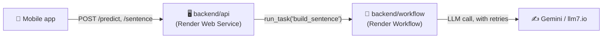

# 🔌 SignBridge Backend (Render)

This is the real API the mobile app talks to — two small services, both deployed on **Render**:



- **`api/`** — a FastAPI web service. Fast, synchronous. Handles `POST /predict`
  (camera frame → recognized letter) directly, since that needs to feel instant.
- **`workflow/`** — a **Render Workflow** service. `POST /sentence` on the API
  hands the actual sentence-building off to this as a durable task — an LLM
  call is exactly the kind of slow/flaky external call Workflows' built-in
  retries are for. If the workflow isn't configured or fails, the API falls
  back to running the same logic in-process, so `/sentence` never just breaks.

## 🚀 Deploying

### 1. The API (`backend/api`)

This repo's `render.yaml` (at the SignBridge root) already describes this
service as an Infrastructure-as-Code Blueprint:

1. On [dashboard.render.com](https://dashboard.render.com), **New > Blueprint**
2. Connect this GitHub repo
3. Render reads `render.yaml` and creates the `signbridge-api` web service
   pointed at `backend/api`
4. In the service's **Environment** tab, set:
   - `GEMINI_API_KEY` (optional — free `llm7.io` backup is used if missing)
   - `RENDER_API_KEY` (only once the workflow below exists — see step 2)

### 2. The Workflow (`backend/workflow`)

Workflows aren't yet supported by `render.yaml`, so this one's set up by hand:

1. **New > Workflow** in the Render dashboard
2. Connect the same GitHub repo
3. **Root Directory**: `backend/workflow`
4. **Build Command**: `pip install -r requirements.txt`
5. **Start Command**: `python main.py`
6. Add environment variable `GEMINI_API_KEY` (optional, same as above)
7. Deploy — this registers the `build_sentence` task

Then go back to the **API** service's environment and add `RENDER_API_KEY`
(an [API key](https://dashboard.render.com/u/settings#api-keys) from your
Render account) so `/sentence` can trigger the workflow task. Without it,
`/sentence` still works — it just runs the LLM call in-process instead of
through a Workflow.

## 🧪 Running locally

```bash
cd backend/api
pip install -r requirements.txt
uvicorn app:app --reload --port 8000
```

`/sentence` will automatically use the in-process fallback locally (no
`RENDER_API_KEY` needed) — same sentence-building logic either way.
