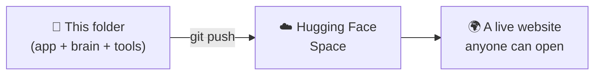

# ☁️ SignBridge on Hugging Face

This folder is a **ready-to-go backpack** 🎒 — everything SignBridge needs to run is already packed inside it, so you can carry it over to Hugging Face and it just works.



---

## ⚠️ Important Heads-Up First

We tried this and hit a paywall: **Hugging Face now asks for a paid "Pro" plan** to run a Python app (like ours) on their free computer tier. Only completely static websites are free to host there now. 😕

**Good news:** we found a totally free alternative instead — the live demo now runs on **Streamlit Community Cloud** here: 👉 [signbridge-asl.streamlit.app](https://signbridge-asl.streamlit.app/)

Still want to try Hugging Face later (maybe you have Pro, or their rules change)? The steps below still work. Just know it might ask you to pay before it lets the app actually run. 💳

---

## 🧳 What's Packed in This Backpack

| File | What it's for |
|---|---|
| 🖥️ `app.py` | The whole app (camera → hand dots → letter → sentence → speech) |
| ✋ `features.py`, `hand_landmarker.py` | The hand-dot-finding tools |
| ✍️ `sentence_builder.py` | Turns letters into a real sentence (Gemini or free backup) |
| 🧠 `sign_model.pkl`, `labels.json` | The trained guessing-robot brain |
| 📦 `assets/hand_landmarker.task` | A helper file MediaPipe needs |
| 📋 `requirements.txt` | The shopping list of tools to install |

---

## 🛠️ Before You Push: Get the Freshest Brain

If you've retrained the model recently, copy the newest version in first:

```bash
# from the SignBridge/ folder
cp model/saved/sign_model.pkl deployment/huggingface_space/sign_model.pkl
cp model/saved/labels.json   deployment/huggingface_space/labels.json
```

*(Windows PowerShell: use `Copy-Item` instead of `cp`.)*

---

## 🔑 Step 1 — Log In to Hugging Face

```bash
pip install -U huggingface_hub
huggingface-cli login
```

It'll ask for a **token** (like a password just for this) — grab one at [huggingface.co/settings/tokens](https://huggingface.co/settings/tokens). Pick "write" access.

## 🏗️ Step 2 — Create Your Space

Go to [huggingface.co/new-space](https://huggingface.co/new-space) and fill in:
- **SDK:** Gradio 🟠
- **Hardware:** free CPU tier is enough
- Pick any name, like `signbridge`

## 🚚 Step 3 — Send the Backpack Over

```bash
cd deployment/huggingface_space
git init
git lfs install
git lfs track "*.pkl" "*.task"
git remote add origin https://huggingface.co/spaces/<your-username>/signbridge
git add .gitattributes
git add .
git commit -m "Initial SignBridge Space"
git push -u origin main
```

> 🐘 **Why `git lfs`?** Our brain file (`sign_model.pkl`) is about **47 MB** — kind of a heavy suitcase! Hugging Face wants big files like this shipped through a special "freight" system called Git LFS instead of the normal way. If you don't have it, grab it free from [git-lfs.com](https://git-lfs.com).

## 🔒 Step 4 — Add Your Secret Key (optional but nice)

On the Space's page: **Settings → Variables and secrets → New secret**
- Name: `GEMINI_API_KEY`
- Value: your free key from [aistudio.google.com](https://aistudio.google.com/apikey)

No key? Totally fine — a free backup AI (`llm7.io`) automatically takes over instead. 🆓

## 🎉 Step 5 — Done!

The Space builds itself automatically after you push (watch the "Building..." logs). Once it says "Running", open it up — your browser will ask for camera permission, and you're live! 📷✨

---

## 📝 Good to Know

- Free CPU can feel a little slower than your own laptop — that's normal for camera + AI running together. 🐢
- The model only knows the letters it was trained on — check `labels.json` for the full list, and `model/README.md` back in the main project for how well it does. 📊
