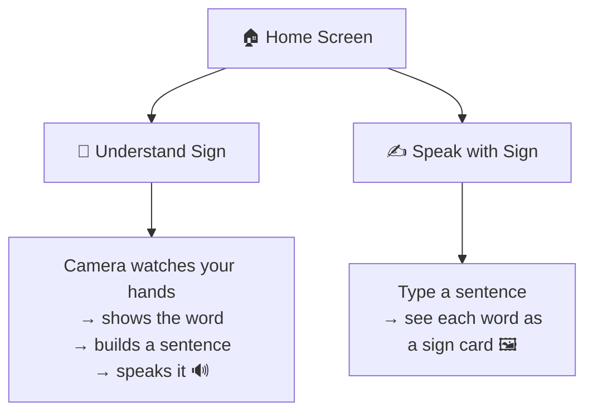

# 📱 SignBridge — The Phone App

This is the mobile version of SignBridge, built with **Expo** (React Native + TypeScript). One home screen, two doors to walk through. 🚪🚪



---

## ▶️ How to Run It

```bash
npm install
npx expo start
```

Then either:
- 📷 Scan the QR code with the **Expo Go** app on your phone (best way to test the camera!), or
- ⌨️ Press `a` for an Android emulator, or `i` for an iOS simulator.

Want to double check the code is healthy? Run `npx tsc --noEmit` — it should print nothing (that means "all good ✅").

---

## 🎭 Real Mode vs. Pretend Mode

Half of this app talks to a real backend, half still fakes it — and that's on purpose, not something half-finished. Everything lives in one file: [`services/api.ts`](./services/api.ts)

```ts
export const API_BASE_URL = 'https://signbridge-api-bruo.onrender.com';
export const IS_PREDICT_MOCK = true;   // 👉 camera recognition: still pretend
export const IS_SENTENCE_MOCK = false; // 👉 sentence-building: genuinely real!
```

| Question we ask | Real or pretend? | Why |
|---|---|---|
| "What sign is this?" → `POST /predict` | 🎭 Pretend | The real endpoint needs a hand-tracking model that needs more memory than our free hosting tier allows — it works, but crashes the server every time it's actually called. Not worth it for now. |
| "Make these words a sentence" → `POST /sentence` | ✅ Real | This one's light (just an AI text call) and runs reliably through a real **Render Workflow** — try it, it actually works! |

### 🔌 To make `/predict` real too:

Once the backend has a bigger instance behind it (see `backend/README.md`), flip `IS_PREDICT_MOCK` to `false` — no other code needs to change, the real network call is already written and waiting.

---

## ✅ What Already Works vs. 🚧 What's Not Done Yet

**✅ Ready to show off:**
- 🏠 Home screen with two big buttons, light & dark mode, matching SignBridge's teal color theme
- 🎥 **Understand Sign**: camera preview, asks for permission nicely, keeps a running list of signs, "Build sentence" button, and "🔊 Speak" which *really* talks out loud (no internet needed for that part!)
- ✍️ **Speak with Sign**: type words, watch them turn into little sign cards one by one, friendly "not learned yet 🤷" message for unknown words
- 🗂️ A simple word-list file ([`data/vocabulary.ts`](./data/vocabulary.ts)) that's easy to add more words to later

**🚧 Still pretend / cut for time:**
- The camera and sentence-builder answers are **faked** until a real backend is wired up (see above)
- 🎙️ Speaking *into* the app (voice-to-text) was skipped — Expo makes this tricky without extra setup, so typing is the way for now
- The fake word list uses simple English words (`hello`, `thank you`...) — once the real model's exact letter/word list is final, someone should double check the names match

---

## 🗂️ Where Everything Lives

```
mobile/
├── App.tsx                        # 🚦 sets up navigation + theme
├── screens/
│   ├── HomeScreen.tsx              # 🏠 the two big buttons
│   ├── UnderstandSignScreen.tsx    # 🎥 camera → text → speech
│   └── SpeakWithSignScreen.tsx     # ✍️ text → sign cards
├── components/
│   ├── OptionCard.tsx              # the big home screen buttons
│   ├── SignCard.tsx                # word → picture card
│   └── PrimaryButton.tsx
├── services/api.ts                 # 🔌 real/pretend backend switch
├── data/vocabulary.ts              # 📖 known words → pictures
└── theme/theme.ts                  # 🎨 colors, spacing, dark mode
```
