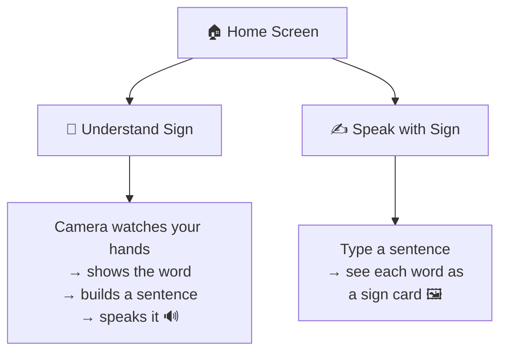

# 📱 SignBridge — The Phone App

This is the mobile version of SignBridge, built with **Expo** (React Native + TypeScript). One home screen, two doors to walk through. 🚪🚪



---

## ▶️ How to Run It

```bash
npm install
npx expo start
```

Then either:
- 📷 Scan the QR code with the **Expo Go** app on your phone (best way to test the camera!), or
- ⌨️ Press `a` for an Android emulator, or `i` for an iOS simulator.

Want to double check the code is healthy? Run `npx tsc --noEmit` — it should print nothing (that means "all good ✅").

---

## 🎭 Real Mode vs. Pretend Mode

Right now the app is running in **pretend mode** (we call it "mock mode"). It fakes the answers so you can click around and see everything working today, even though the real brain isn't plugged in yet. Think of it like a dress rehearsal. 🎬

Everything lives in one file: [`services/api.ts`](./services/api.ts)

```ts
export const API_BASE_URL = 'http://localhost:7860'; // 👉 put the real backend link here
export const IS_MOCK = true;                          // 👉 flip to false when ready
```

### 🔌 To connect the real brain:

1. Put the real backend's web address into `API_BASE_URL`.
2. Change `IS_MOCK` to `false`.
3. Make sure that backend answers these two questions the same way:

| Question we ask | What we send | What we expect back |
|---|---|---|
| "What sign is this?" → `POST /predict` | `{ image_base64 }` | `{ label, confidence }` |
| "Make these words a sentence" → `POST /sentence` | `{ words }` | `{ sentence }` |

That's it — no other code needs to change! The real network calls are already written, just waiting to be switched on. 🔦

> 🚧 **Heads up:** the live [Streamlit demo](https://signbridge-asl.streamlit.app/) is a full web page, not this kind of simple API — so it can't be plugged in here as-is yet. Someone on the team needs to wrap the model in a tiny API (like the `/predict` and `/sentence` shape above) before this toggle can go live for real.

---

## ✅ What Already Works vs. 🚧 What's Not Done Yet

**✅ Ready to show off:**
- 🏠 Home screen with two big buttons, light & dark mode, matching SignBridge's teal color theme
- 🎥 **Understand Sign**: camera preview, asks for permission nicely, keeps a running list of signs, "Build sentence" button, and "🔊 Speak" which *really* talks out loud (no internet needed for that part!)
- ✍️ **Speak with Sign**: type words, watch them turn into little sign cards one by one, friendly "not learned yet 🤷" message for unknown words
- 🗂️ A simple word-list file ([`data/vocabulary.ts`](./data/vocabulary.ts)) that's easy to add more words to later

**🚧 Still pretend / cut for time:**
- The camera and sentence-builder answers are **faked** until a real backend is wired up (see above)
- 🎙️ Speaking *into* the app (voice-to-text) was skipped — Expo makes this tricky without extra setup, so typing is the way for now
- The fake word list uses simple English words (`hello`, `thank you`...) — once the real model's exact letter/word list is final, someone should double check the names match

---

## 🗂️ Where Everything Lives

```
mobile/
├── App.tsx                        # 🚦 sets up navigation + theme
├── screens/
│   ├── HomeScreen.tsx              # 🏠 the two big buttons
│   ├── UnderstandSignScreen.tsx    # 🎥 camera → text → speech
│   └── SpeakWithSignScreen.tsx     # ✍️ text → sign cards
├── components/
│   ├── OptionCard.tsx              # the big home screen buttons
│   ├── SignCard.tsx                # word → picture card
│   └── PrimaryButton.tsx
├── services/api.ts                 # 🔌 real/pretend backend switch
├── data/vocabulary.ts              # 📖 known words → pictures
└── theme/theme.ts                  # 🎨 colors, spacing, dark mode
```
