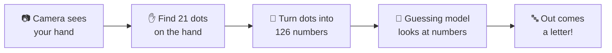
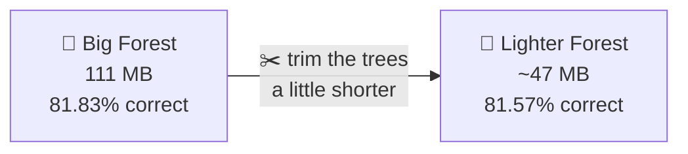

# 🖐️➡️🔤 How We Taught a Computer to Read Hands

This folder holds the "brain" 🧠 of SignBridge — the part that looks at a hand and guesses which letter it is. This page tells the whole story: what we tried, what we threw away, and what we ended up shipping.

No boring walls of text, promise. Just the journey. 🚀

---

## 🗺️ The Big Picture

Here's what happens every single time, from camera to letter:



Easy right? Now let's zoom into each box. 🔍

---

## 1️⃣ Step One — Getting Hand Pictures 🎥

A guessing model can't learn from nothing. It needs to **see lots of examples first**, like flashcards. 🃏

We had two ways to make flashcards:

| Way | How it works | File |
|---|---|---|
| 🙋 **Record yourself** | Turn on your webcam and hold up a sign — instant flashcard! | `collect_landmarks.py` |
| 🌍 **Use a ready-made dataset** | Download thousands of hand photos other people already took | `extract_landmarks_from_dataset.py` |

We used the second one to get started fast: **10,873 hand photos** of the alphabet from a free dataset on Hugging Face called `asl_sign_languages_alphabets_v03`. 📦

> 🚫 **Fun fact:** We skipped the letters **J** and **Z**! In real sign language, those two letters need you to *move* your hand (like drawing the letter in the air ✍️). But our robot only looks at **still photos**, not movies — so J and Z would just look like blurry versions of other letters. We kept it simple and used the other **24 letters** instead.

✅ **Done when:** we have a big pile of labeled hand photos — "this photo = A", "this photo = B", and so on.

---

## 2️⃣ Step Two — Turning a Hand Into Numbers 🔢

Computers are bad at "looking" at pictures the way we do. So instead of showing the robot a picture, we give it **numbers** instead. Numbers are way easier for a computer to compare! 🧮

Here's how, step by step:

1. 🖐️ A tool called **MediaPipe** finds **21 special dots** on your hand (fingertips, knuckles, wrist — like connect-the-dots).
2. 📍 Each dot has a position: how far left/right, up/down, and near/far (that's **3 numbers per dot**).
3. ✖️ 21 dots × 3 numbers = **63 numbers for one hand**. We leave room for a second hand too, so our final list is **126 numbers**.
4. 📏 We also **resize and re-center** the numbers, kind of like zooming a photo so the hand always looks the same size. This way, it doesn't matter if you sign close to the camera or far away — the robot still recognizes it! 🔎

This turns *any* hand photo into the exact same kind of list: **126 numbers**. That list is called a **feature vector** (fancy words for "hand described as numbers"). This magic happens in `features.py`, using the hand-finding tool wrapped in `hand_landmarker.py`.

✅ **Done when:** every flashcard photo has been turned into its own row of 126 numbers, saved together in one big spreadsheet: `data/landmarks/dataset.csv`.

---

## 3️⃣ Step Three — The Guessing-Robot Race 🏁

Now for the fun part! There isn't just *one* way to build a guessing robot — there are many. So we held a **race** 🏎️ to see which one guesses best. This happens in `compare_models.py`.

We lined up 5 robots at the starting line:

| # | Robot's Nickname | Real Name | What happened |
|---|---|---|---|
| 🌲 | **The Forest of Mini-Guessers** | Random Forest | 🏆 Finished fast, guessed great! |
| 📍 | **The "Who's Closest?" Robot** | k-Nearest Neighbors (k-NN) | 🥈 Super fast, decent guesses |
| ➗ | **The Line-Drawer** | Linear SVM | 🥉 Finished, but guessed less |
| 🐢 | **The Curvy Line-Drawer** | SVM with RBF kernel | ❌ Took 20+ minutes and still wasn't done — disqualified! |
| 🐌 | **The Step-by-Step Booster** | Gradient Boosting | ❌ Same problem — way too slow with 24 letters |

> 💡 **Why kick two robots out?** We only had **1.5 days** for this whole hackathon! Two of the robots were so slow to train that they would've eaten our whole afternoon without even finishing. So we said "thanks, but next time" and kept the **3 robots that actually finished**. Fast and good-enough beats slow and perfect when the clock is ticking. ⏰

### 🏅 The Race Results

| Robot | Accuracy (higher = better) | Speed per guess |
|---|---|---|
| 🌲 **Random Forest** | **81.6%** ✅ | 96.7 ms |
| 📍 k-NN | 77.9% | 17.7 ms ⚡ |
| ➗ Linear SVM | 73.2% | 42.9 ms |

**Accuracy** just means: out of 100 hand signs it's never seen before, how many did it guess correctly? 81.6% means it gets about **8 out of every 10 signs right**. 🎯

---

## 4️⃣ Step Four — Picking the Winner (and Putting It on a Diet) 🏆🎒

**Random Forest** won! 🌲🥇 It's like asking **100 mini-guessers** to each look at the hand and vote — then going with whatever most of them agree on. Voting like this makes it much harder to be tricked by one weird photo.

But there was a problem: our winning robot's "brain file" was **111 MB** — too big and chunky to easily upload to GitHub! 😅 So we put it on a small diet:



We trimmed how deep each mini-guesser's decision tree could go. Result: **more than half the size**, for basically the **same accuracy** (we lost only 0.26%, less than 1 guess out of 500!). Now it fits easily in our project's backpack (the GitHub repo). 🎒✨

---

## 🧠 Meet the Current Model

Here's our robot's report card today:

| 📋 | |
|---|---|
| 🏷️ **Type** | Random Forest (100 mini-guessers, each allowed to think up to 25 steps deep) |
| 🔤 **Knows these letters** | A–I, K–Y (24 letters — no J or Z, remember why? 👆) |
| 🎯 **Accuracy** | ~81.6% on signs it's never seen |
| ⚡ **Speed** | Fast enough for live video, no lag |
| 💾 **File size** | ~47 MB (`model/saved/sign_model.pkl`) |
| 📄 **Label list** | `model/saved/labels.json` |
| 📚 **Learned from** | 5,968 hand examples (24 letters × ~250 each) |

---

## 🔁 Want to Redo Any of This?

```bash
# Get more flashcards from the free online dataset
python model/extract_landmarks_from_dataset.py

# ...or record your own with a webcam
python model/collect_landmarks.py

# Run the robot race again and save the winner
python model/compare_models.py
```

Every script writes to the same spreadsheet and the same "winner" files, so you can mix your own recorded signs with the downloaded ones — they just add together. 🧩
