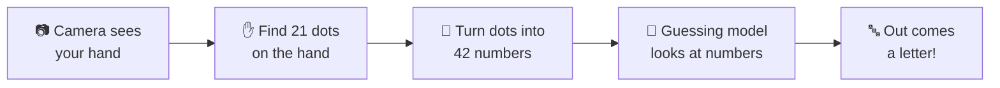
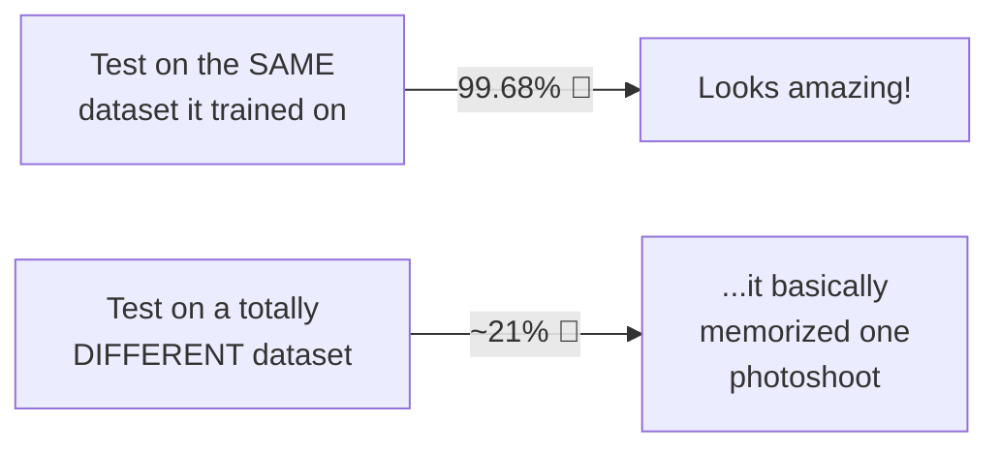
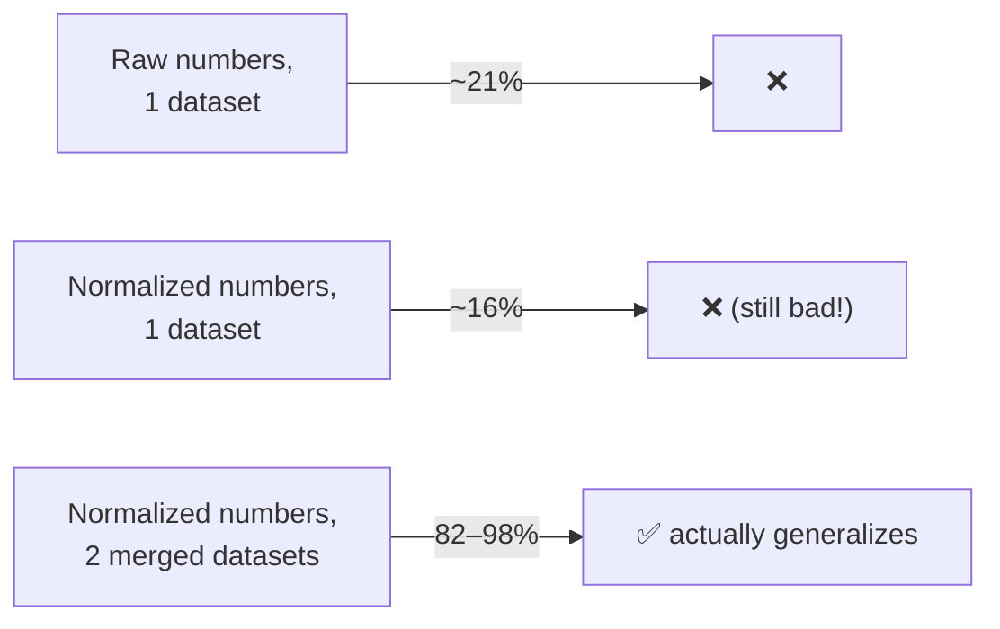

# 🖐️➡️🔤 How We Taught a Computer to Read Hands

This folder holds the "brain" 🧠 of SignBridge — the part that looks at a hand and guesses which letter it is. This page tells the whole story: what we tried, what we threw away, and what we ended up shipping.

No boring walls of text, promise. Just the journey. 🚀

---

## 🗺️ The Big Picture

Here's what happens every single time, from camera to letter:



Easy right? Now let's zoom into each box. 🔍

---

## 1️⃣ Step One — Getting Hand Pictures 🎥

A guessing model can't learn from nothing. It needs to **see lots of examples first**, like flashcards. 🃏

We turned a big folder of labeled hand photos (one folder per letter, A through Z) into flashcards using `extract_landmarks.py` at the project root — it looks at every photo, finds the hand, and writes down what it sees as a row of numbers.

That gave us **60,283 flashcards** covering the **full A–Z alphabet** — way more than what we started with in an earlier version of this project (a smaller ~6,000-photo set that only covered 24 letters).

> 🤔 **Heads up about J and Z:** in real sign language, those two letters need you to *move* your hand (like drawing the letter in the air ✍️), but our dataset treats them as still poses like every other letter. That means J/Z recognition is a bit less reliable live than the other 24 letters — something we're upfront about, not hiding.

✅ **Done when:** we have a big pile of labeled hand photos — "this photo = A", "this photo = B", and so on — turned into numbers and saved together in one spreadsheet: `data/landmarks/hand_landmarks.csv`.

---

## 2️⃣ Step Two — Turning a Hand Into Numbers 🔢

Computers are bad at "looking" at pictures the way we do. So instead of showing the robot a picture, we give it **numbers** instead. Numbers are way easier for a computer to compare! 🧮

Here's how, step by step:

1. 🖐️ A tool called **MediaPipe** finds **21 special dots** on your hand (fingertips, knuckles, wrist — like connect-the-dots).
2. 📍 Each dot has a position: how far left/right (x) and up/down (y) — that's **2 numbers per dot**.
3. ✖️ 21 dots × 2 numbers = **42 numbers per hand** — our full feature list.

This turns *any* single-hand photo into the exact same kind of list: **42 numbers**. That list is called a **feature vector** (fancy words for "hand described as numbers"). This magic happens in `features.py`, using the hand-finding tool wrapped in `hand_landmarker.py` (both live in this folder, and a copy also ships in `backend/api/` for the live API).

✅ **Done when:** every flashcard photo has been turned into its own row of 42 numbers.

---

## 3️⃣ Step Three — The Guessing-Robot Race 🏁

There isn't just *one* way to build a guessing robot — there are many. Early on, we held a **race** 🏎️ between a few different algorithms to see which one guesses best:

| # | Robot's Nickname | Real Name | What happened |
|---|---|---|---|
| 🌲 | **The Forest of Mini-Guessers** | Random Forest | 🏆 Finished fast, guessed great! |
| 📍 | **The "Who's Closest?" Robot** | k-Nearest Neighbors (k-NN) | 🥈 Super fast, decent guesses |
| ➗ | **The Line-Drawer** | Linear SVM | 🥉 Finished, but guessed less |
| 🐢 | **The Curvy Line-Drawer** | SVM with RBF kernel | ❌ Took 20+ minutes and still wasn't done — disqualified! |
| 🐌 | **The Step-by-Step Booster** | Gradient Boosting | ❌ Same problem — way too slow with lots of classes |

> 💡 **Why kick two robots out?** Hackathons run on the clock! Two of the robots were so slow to train that they would've eaten our whole afternoon without even finishing. So we kept the **3 robots that actually finished** — fast and good-enough beats slow and perfect when time is tight. ⏰

**Random Forest** won that race by a clear margin, so when a teammate rebuilt the dataset with 10x more photos and the full alphabet, we kept Random Forest as the algorithm and simply retrained it on the bigger pile of data (see `train.py`).

---

## 🚨 The Plot Twist — 98% Wasn't What It Looked Like

Testing a model on photos it saw *the same photoshoot as* is like studying for a test using the exact questions that'll be on it. So we grabbed a **second, totally unrelated ASL photo dataset** (Marxulia's) that the model had never seen even one picture from, and tried it there instead.



That gap gave it away: the model wasn't learning *what an A looks like* — it was learning *where in this specific dataset's photos a hand tends to sit, and how big it tends to look*. Change the camera, the background, or how close the hand is, and it got lost.

**The fix had two parts:**

1. **Make the numbers position/size-proof.** Instead of raw dot positions, we shift every hand so the wrist sits at (0,0), then shrink/stretch it so its biggest dot-to-wrist distance is always exactly 1. Now "A" always looks like the same *shape* to the model, no matter where the hand was in the photo or how close the camera was. This lives in `normalize_vector()` inside `features.py`.
2. **Learn from more than one photoshoot.** Normalization alone actually made things *slightly worse* (16%) — proof the real problem was never having seen more than one dataset's "style" of hand photo. So we merged in the second dataset (8,399 more examples) and retrained on both together.



---

## 🧠 Meet the Current Model

Here's our robot's honest report card:

| 📋 | |
|---|---|
| 🏷️ **Type** | Random Forest (200 mini-guessers voting together) |
| 🔤 **Knows these letters** | The full alphabet, A–Z (26 letters) |
| 🎯 **Accuracy on its own dataset's held-out photos** | 98.4% |
| 🎯 **Accuracy on a totally different, never-trained-on dataset** | 82.3% |
| 🎯 **Combined honest accuracy** | 96.5% |
| ⚡ **Speed** | Fast enough for live video, no lag |
| 💾 **File** | `model/sign_model.pkl` (also copied into `backend/api/` for the live API) |
| 📄 **Label list** | `model/labels.json` |
| 📚 **Learned from** | 68,681 hand examples, merged from two independent photo datasets |

We report *both* numbers on purpose instead of just the flattering one — the gap between them is exactly the "does it generalize, or did it just memorize" question, and it's the whole reason this model looks the way it does today. M and N are the weakest letters (~90% each) since they're both fist-shaped and genuinely hard to tell apart, even for people. 🎯

---

## 🔁 Want to Redo Any of This?

```bash
# from the SignBridge/ folder
# 1. Turn a folder of labeled hand photos (data/raw/<LETTER>/*.jpg) into numbers
python extract_landmarks.py

# 2. Normalize a second dataset's photos and merge + retrain (see the plot twist above)
python extract_marxulia_normalized.py
python retrain_merged.py
```

`retrain_merged.py` writes the final `model/sign_model_merged.pkl` — copy it over `model/sign_model.pkl` and `backend/api/sign_model.pkl` to ship it. `python model/train.py` still works if you want to go back to the single-dataset, un-normalized baseline for comparison, but it's not what's deployed. 🧩
