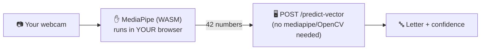

# 🌐 SignBridge Website

**Live:** https://magenta-concha-e2e893.netlify.app

A professional, single-page site with a genuinely-working live demo — and a
better architecture than our first backend attempt.

## Why this exists (and why it fixes the memory problem)

`backend/api`'s original `/predict` endpoint needed mediapipe + OpenCV loaded
server-side, which OOM-crashed Render's free-tier 512MB instance every time
it ran (see `backend/README.md`). This site sidesteps that entirely:



Hand tracking (the heavy part) runs client-side via MediaPipe's official
WASM build — no video ever leaves the browser, and the server only ever
receives 42 small numbers. `backend/api/app.py`'s `/predict-vector` endpoint
loads only `joblib` + `scikit-learn` for this, so it never touches the
memory ceiling that broke `/predict`.

## Stack

Plain HTML/CSS/JS, no build step, no framework:
- `index.html` / `css/style.css` — the page and design system
- `js/app.js` — camera capture, MediaPipe hand tracking, feature-vector
  extraction (mirrors `backend/api/features.py` exactly), and calls to
  `/predict-vector` and `/sentence`

## Running locally

```bash
cd website
python -m http.server 5500
# open http://127.0.0.1:5500
```

## Deploying

Deployed via the Netlify CLI:

```bash
cd website
npx netlify-cli login      # first time only
npx netlify-cli deploy --dir=. --prod
```
